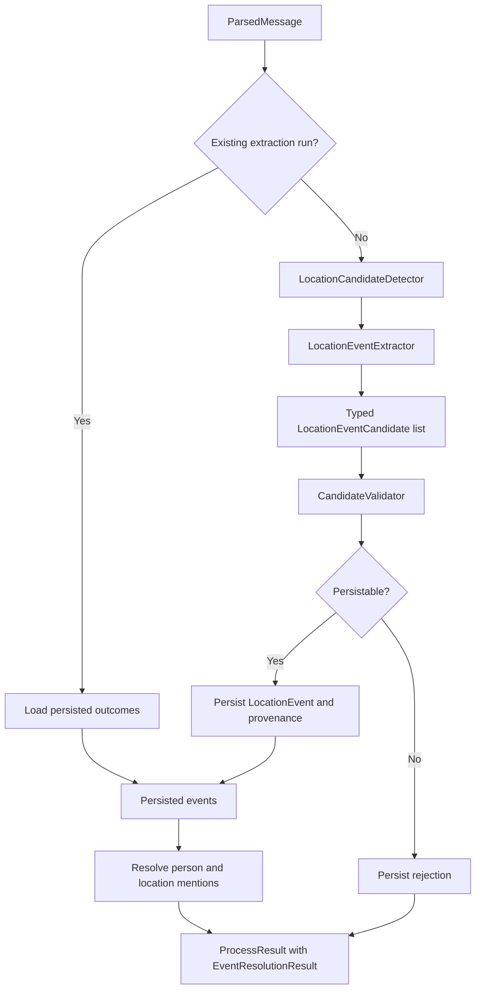
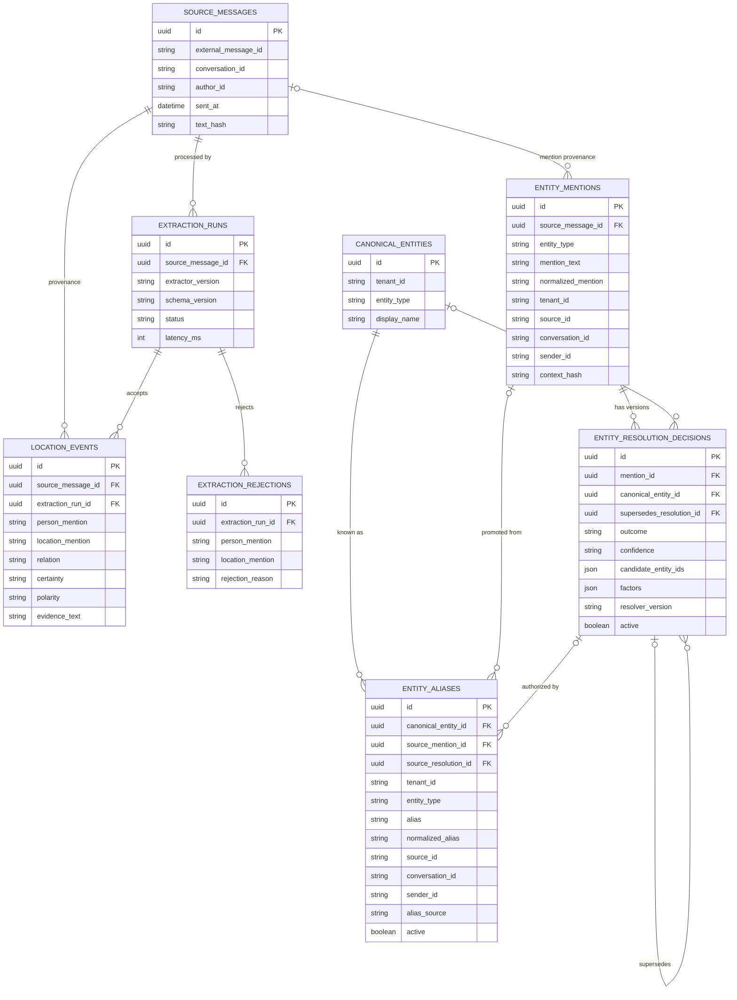
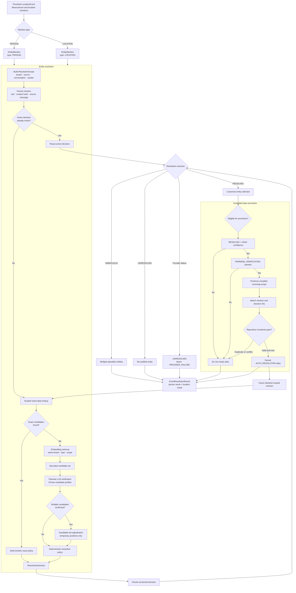

# Design

This document is the compact technical specification for the MVP. `TASK.md` defines the
product scope; `README.md` explains operation and local development.

## Architecture

The service is a modular monolith with dependency-inverted boundaries. This document owns the
detailed process diagrams; the README keeps only a compact project overview.

### End-to-end processing

Extraction persistence precedes entity resolution. They use separate transactions so replay can
repair an interrupted resolution phase without duplicating the source message or event.

### Component responsibilities

| Component | Responsibility | Separation reason |
|---|---|---|
| `ParsedMessage` | Typed contract for one upstream message | Keeps platform payloads outside the domain |
| `Settings` and TOML files | Load models, versions, prompts, limits, and deployment overrides | Keeps configuration out of business logic |
| `LocationExtractionService` | Orchestrate detection, extraction, validation, and persistence | Makes the extraction use case independently testable |
| `LocationCandidateDetector` | Decide whether extraction is needed | Allows a future measured pre-filter without coupling it to persistence |
| `LocationEventExtractor` | Produce typed semantic candidates | Isolates provider-specific APIs and types |
| `CandidateValidator` | Enforce deterministic persistence rules and evidence provenance | Structured output alone cannot enforce business correctness |
| `LocationEventRepository` | Persist idempotent extraction outcomes | Isolates transactions and SQLAlchemy |
| `PersistedEventResolutionWorkflow` | Resolve explicit person and location mentions after persistence | Keeps canonical identity outside extraction |
| `EntityCandidateRetriever` | Return candidates within tenant, type, and scope | Prevents semantic models from expanding the search boundary |
| Pairwise and candidate-set verifiers | Return typed ID-free semantic verdicts | The model cannot select internal identifiers |
| `VerifiedResolutionPolicy` | Map validated verdicts to a deterministic decision | Keeps final identity selection in trusted code |
| `ControlledAliasPromotionPolicy` | Propose narrow aliases from high-confidence decisions | Prevents uncertain outcomes from training future lookup |
| Resolution repository | Persist entities, aliases, mentions, and reversible decisions | Enforces scope, type, and provenance again at the storage boundary |
| `ProcessResult` | Return extraction and resolution outcomes | Avoids conflating an event with canonical identity |

### PostgreSQL relationships

`candidate_entity_ids` is an audit snapshot stored as JSON, not a foreign-key relationship. The
repository validates every referenced candidate against the mention tenant and entity type before
writing the decision. A partial unique index permits only one active decision per mention. Each new
decision can supersede at most one previous decision. The current foreign key does not prevent two
new rows from referencing the same previous decision, although the repository workflow normally
creates a linear chain; enforcing a single successor would require an additional unique constraint
on non-null `supersedes_resolution_id`.

Deletion behavior is deliberate: extraction descendants cascade with their source/run; deleting a
canonical entity cascades its aliases but is restricted while an active or historical decision
references it. Deleting message or decision provenance sets the corresponding optional mention or
alias link to null instead of deleting the resolution history.

The default detector is `AlwaysPassDetector`. Stanza is not currently used; a future detector
may pre-filter messages only after its recall has been measured. Detector output must never
create domain events.

The LLM is a semantic parser, not a source of business truth. It returns typed candidates and
cannot select database identifiers or persist state. The application validates every candidate
deterministically before persistence.

## Contextual entity resolution foundation

Entity resolution is a post-validation boundary invoked after an accepted event has been persisted:

If embedding or verification is unavailable, the workflow saves `UNRESOLVED` with the
`PROVIDER_FAILURE` factor. Repository and programming errors are not converted into semantic
abstentions.

`PERSON` and `LOCATION` share orchestration contracts but never share candidates. Tenant is a hard
security boundary. Source, conversation, and sender are optional scope dimensions: a scoped alias
is eligible only when every dimension recorded on that alias matches the incoming mention. A more
specific exact alias outranks a tenant-wide alias; equally specific winners remain ambiguous.

The first retriever performs Unicode normalization, case folding, whitespace normalization, and
exact alias lookup. It contains no English word lists or fuzzy merge rules. This is the measurable
baseline for future embedding retrieval and reranking. Models may rank bounded candidates or make
typed pairwise semantic assessments, but deterministic policy retains the final decision and models
never select or write database identifiers.

Resolution evaluation separates retrieval from decision quality. Candidate recall@K and candidate
set recall measure whether the correct entity reaches the bounded candidate set. Top-1 accuracy,
outcome accuracy, resolved precision, automatic-resolution coverage, ambiguity accuracy, and
unresolved accuracy measure policy behavior. Tenant and entity-type leakage are release-blocking
counts and must remain zero. Semantic retrieval is allowed to improve recall and coverage only if
resolved precision and isolation do not regress.

The first semantic experiment is exact-first: an exact scoped alias short-circuits model access;
otherwise the embedder receives the bounded mention/context and only aliases eligible in the same
tenant, entity type, and scope. It returns ranked candidates, not an identity decision. Embedding-
only candidates carry `EMBEDDING_SIMILARITY`; the deterministic policy keeps them `UNRESOLVED` until
a separately evaluated reranker/decision policy establishes safe automatic-link criteria. No
vectors are persisted and no vector database is used in this phase.

The optional reranking experiment consumes only the bounded candidates returned by embedding
retrieval. It cannot introduce an entity, cross a scope boundary, or persist a decision. Candidate
documents include the canonical name and every alias already proven eligible for the incoming
scope; omitting those aliases was measured to harm contextual person ranking. The common
`POST /rerank` transport is isolated behind `MentionReranker`, and provider scores remain audit
signals rather than identity truth. Exact aliases still short-circuit both model calls.

The expanded 24-case fixture adds same-name people with different roles, similarly named locations
with different purposes, and unsupported hard negatives. Across three live runs, `bge-m3` retained
top-1 accuracy 1.0 while `bge-reranker-v2-m3` consistently reached 0.941 by confusing `central
branch` with a logistics hub. The maximum reranker score on an unresolved case was about 0.976,
which also rules out a simple absolute-score threshold. Both modes retained recall@3 1.0 and zero
tenant/type leakage. Reranking therefore remains experimental and automatic semantic links remain
disabled; a deterministic acceptance policy cannot yet be justified by these scores.

For synthetic functional proof, semantic confirmation uses two typed stages. Pairwise verification
classifies each ID-free mention/profile pair as `SAME_ENTITY`, `DIFFERENT_ENTITY`, or `UNCERTAIN`.
If more than one pair is confirmed, bounded candidate-set adjudication returns `UNIQUE_MATCH`,
`NO_MATCH`, or `AMBIGUOUS` using temporary one-based positions. The model never receives UUIDs;
deterministic policy validates the selected position before mapping it to an internal entity ID.

The verifier has been evaluated only against prepared English synthetic ground truth. On the
current 24-case dataset, the final blind `deepseek-v4-flash` run with
`bge-m3` retrieval reached outcome accuracy, resolved precision, ambiguity accuracy, and unresolved
accuracy of 1.0 with zero tenant/type leakage. Raw pairwise precision was materially lower, so
pairwise verdicts must never be persisted directly as identity decisions; candidate-set
adjudication and deterministic aggregation are required parts of the measured behavior.

The application composition enables this evaluated path after persistence. It creates deterministic
mention IDs from event IDs, stores bounded-context provenance, reuses an active decision on replay,
short-circuits exact aliases, and invokes semantic retrieval and verification only for non-exact
mentions. Extraction persistence and resolution use separate transactions; replay repairs a missing
resolution phase without duplicating the source message or event.

Resolution records are append-oriented and reversible:

- `canonical_entities`: tenant-owned person or location identities;
- `entity_aliases`: explicit aliases with source/conversation/sender scope and provenance source;
- `entity_mentions`: literal mentions, scope, source-message provenance, and context hash;
- `entity_resolution_decisions`: outcome, confidence, candidate ids, factors, resolver version,
  active state, and an optional superseded decision.

Only one decision may be active for a mention. Repository checks prevent decisions and candidate
references from crossing tenant or entity-type boundaries; a database partial unique index protects
the active-decision invariant under concurrent writes.

Source message text and bounded semantic context are not copied into resolution decisions. The
literal mention is retained for auditability; optional context is represented by a hash at rest.

Controlled alias promotion runs only after a newly created or replayed active decision passes a
stricter policy than resolution itself: the outcome must be `RESOLVED`, confidence must be `HIGH`,
and factors must include pairwise semantic verification. The promoted literal keeps the complete
tenant/source/conversation/sender scope and foreign-key provenance to both mention and decision.
The repository independently verifies all of these invariants and refuses conflicting or duplicate
aliases. Exact matches, medium confidence, ambiguity, unresolved mentions, and provider failures
cannot train the alias catalog. Creating a new canonical entity remains outside the endpoint.

## Domain contract

`LocationEventCandidate` describes untrusted model output:

- literal `person_mention` and `location_mention`;
- typed explicitness: `EXPLICIT`, `REFERENCE`, or `UNKNOWN`;
- relation: `AT`, `TO`, `FROM`, `LEFT`, `ARRIVED`, `NEAR`, or `UNKNOWN`;
- certainty: `ASSERTED`, `PROBABLE`, `POSSIBLE`, `NEGATED`, `PLANNED`, or `UNKNOWN`;
- polarity: `POSITIVE`, `NEGATIVE`, or `UNKNOWN`;
- optional location type and raw temporal expression;
- evidence text and character offsets;
- ambiguity flag and bounded reason.

An accepted `LocationEvent` is a sourced assertion, movement, plan, uncertainty, or negation.
It is not a person's derived current location. That state may later be computed from trustworthy
events using explicit business rules.

## Extraction rules

The MVP extraction contract and all automated evaluation data are English-only. Support for
additional languages requires separate datasets and quality baselines and is tracked in the
roadmap. Extraction operates on one message without dialogue history.

- Extract physical person-location presence or movement only.
- Preserve literal mentions and evidence; do not canonicalize or geocode.
- Keep presence, direction, arrival, and departure distinct.
- Preserve assertion, uncertainty, negation, and future plans.
- Return multiple independent events when present.
- Abstain when the person or location is unresolved or the text only expresses preference,
  discussion, ownership, imagination, or a conditional situation.
- Do not expose chain-of-thought. Structured output is enforced by the Pydantic/JSON schema.

Examples:

| Message | Result |
|---|---|
| `John is in London.` | `John / London / AT / ASSERTED` |
| `Peter arrived in Astana.` | `ARRIVED / ASSERTED` |
| `Anna is going to the airport.` | `TO`; not confirmed `AT` |
| `John is not in London.` | `AT / NEGATED` |
| `John may be in London.` | `AT / POSSIBLE` |
| `John will travel to London tomorrow.` | `TO / PLANNED`, preserve `tomorrow` |
| `John said that Mary is in Boston.` | subject is `Mary` |
| `John likes London.` | no event |
| `He is in London.` | reject/abstain: unresolved person |
| `John is there.` | reject/abstain: unresolved location |

## Deterministic validation

A candidate is persistable only when:

- person, location, and evidence are present;
- person and location are typed as explicit;
- evidence occurs in the source and contains both literal mentions;
- offsets match, or can be repaired from one unique evidence occurrence;
- relation is known and the candidate is not ambiguous;
- polarity and certainty are consistent.

Expected rejections are returned as typed reasons, not generic exceptions. Validation relies on
typed semantic fields rather than language-specific word lists or regular expressions.

## Persistence and provenance

PostgreSQL stores:

- `source_messages`: external identity, metadata, timestamp, and text hash;
- `extraction_runs`: provider/model/version, status, latency, and the idempotency record;
- `location_events`: accepted event fields and evidence;
- `extraction_rejections`: rejected candidates and typed reasons.

The idempotency key is the source message plus extractor and schema versions. Reprocessing with a
new version remains possible. Schema changes use Alembic migrations. ORM models do not cross the
public API boundary.

## Security and operations

Location data is sensitive. Store only required fields, keep secrets in environment variables,
and do not log complete messages or plaintext person-location pairs. Logs use identifiers, hashes,
lengths, typed outcomes, and latency. Only the current message is sent to the configured provider.

HTTPS is the default provider transport. Plain HTTP requires explicit configuration and is only
intended for a trusted internal network accepted by the deployment owner. Production deployment
still needs authentication, authorization, retention, deletion, and tenant-boundary policies.

## Testing policy

Normal CI is deterministic and does not call a live model:

- unit tests cover contracts, validation, orchestration, adapter mapping, and SQLite repository
  behavior;
- API tests cover request validation and response outcomes;
- PostgreSQL integration tests cover migrations, persistence, and idempotency;
- live model evaluations are opt-in and report provider reliability separately from semantic
  quality. They may execute independent single-message requests with bounded concurrency, while
  preserving dataset order and recording latency/retry statistics.
- deterministic entity-resolution evaluation runs locally without network access and includes
  exact aliases, scoped ambiguity, isolation negatives, and semantic-retrieval challenge cases.

Every extraction change should add a positive case and a contrastive negative case. Important
regression dimensions are subject attribution, false-positive locations, modality/negation,
movement versus presence, missing context, and evidence provenance.

## Accepted decisions

1. Store immutable sourced events; derive current location later.
2. Treat LLM output as an untrusted candidate.
3. Keep a modular monolith until scaling evidence justifies another deployment model.
4. Keep Stanza optional and recall-oriented.
5. Preserve raw temporal text if normalization is added.
6. Prefer explicit abstention over fabricated resolution.
7. Use typed semantics instead of lexical validation rules.
8. Resolve entities only after extraction validation and preserve the original literal event.
9. Prefer reversible mention-to-entity decisions over destructive canonical-entity merges.
10. Keep embeddings and rerankers behind ports and require dataset evidence before activation.
11. Treat embedding similarity as candidate retrieval evidence, never as sufficient merge proof.
